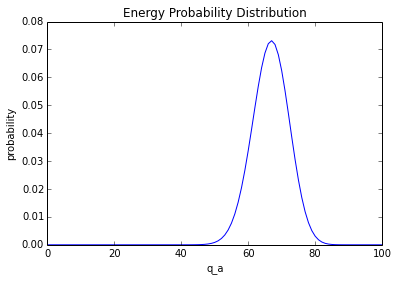

## Problem Set 10, by Chris Silvia

#### Problem 2.5

For an Einstein solid with each of the following values of $N$ and $q$, list all
of the possible microstates.

The number of einstein microstates is the same as the number of ways to put $q$
balls in $N$ slots.

0 0 0 | | 0 0 |

There are $N + q - 1$ possible places to put things in general, and choices of
where the slots are ($q$ of them) uniquely determine the formula.

$$
\Omega(N,q) = {{q + N -1} \choose q}
$$

    import numpy as np
    
    def fact(n):
        i = 1
        for j in range(1,n+1):
            i *= j
        return i
    
    def choose(n,k):
        """Computes n choose k"""
        return fact(n)/(fact(n-k) * fact(k))
    
    def einstein_solid(N,q):
        """Number of states for an einstein solid 
        with N oscillators and q units of energy. 
        Returns an integer"""
        return choose(q + N - 1,q)
    
    def einstein_solid_microstates(N,q):
        """Lists, explicitly, the microstates for an
        einstein solid of N oscillators with q units of
        energy.  THIS IS RECURSIVE, don't do big things"""
        states = []
        if N == 1:
            return [[q]]
        elif q == 0:
            return [[0 for i in range(0,N)]]
        elif q == 1:
            for i in range(0,N):
                states += [[ 1 if n == i else 0 for n in range(0,N)]]
            return states
        else:
            for i in range(0,q+1):
                states += [[i]+xtail for xtail in einstein_solid_microstates(N-1,q-i)]
            return states
            
    
    data = [("a",3,4),("b",3,5),("c",3,6),("d",4,2),("e",4,3)]
    
    for number,N,q in data:
        print "{0}: N={1} q={2} n_microstates={3}\nThe actual microstates:\n{4}".format(
        number,N,q,einstein_solid(N,q),einstein_solid_microstates(N,q))

    a: N=3 q=4 n_microstates=15
    The actual microstates:
    [[0, 0, 4], [0, 1, 3], [0, 2, 2], [0, 3, 1], [0, 4, 0], [1, 0, 3], [1, 1, 2], [1, 2, 1], [1, 3, 0], [2, 0, 2], [2, 1, 1], [2, 2, 0], [3, 1, 0], [3, 0, 1], [4, 0, 0]]
    b: N=3 q=5 n_microstates=21
    The actual microstates:
    [[0, 0, 5], [0, 1, 4], [0, 2, 3], [0, 3, 2], [0, 4, 1], [0, 5, 0], [1, 0, 4], [1, 1, 3], [1, 2, 2], [1, 3, 1], [1, 4, 0], [2, 0, 3], [2, 1, 2], [2, 2, 1], [2, 3, 0], [3, 0, 2], [3, 1, 1], [3, 2, 0], [4, 1, 0], [4, 0, 1], [5, 0, 0]]
    c: N=3 q=6 n_microstates=28
    The actual microstates:
    [[0, 0, 6], [0, 1, 5], [0, 2, 4], [0, 3, 3], [0, 4, 2], [0, 5, 1], [0, 6, 0], [1, 0, 5], [1, 1, 4], [1, 2, 3], [1, 3, 2], [1, 4, 1], [1, 5, 0], [2, 0, 4], [2, 1, 3], [2, 2, 2], [2, 3, 1], [2, 4, 0], [3, 0, 3], [3, 1, 2], [3, 2, 1], [3, 3, 0], [4, 0, 2], [4, 1, 1], [4, 2, 0], [5, 1, 0], [5, 0, 1], [6, 0, 0]]
    d: N=4 q=2 n_microstates=10
    The actual microstates:
    [[0, 0, 0, 2], [0, 0, 1, 1], [0, 0, 2, 0], [0, 1, 1, 0], [0, 1, 0, 1], [0, 2, 0, 0], [1, 1, 0, 0], [1, 0, 1, 0], [1, 0, 0, 1], [2, 0, 0, 0]]
    e: N=4 q=3 n_microstates=20
    The actual microstates:
    [[0, 0, 0, 3], [0, 0, 1, 2], [0, 0, 2, 1], [0, 0, 3, 0], [0, 1, 0, 2], [0, 1, 1, 1], [0, 1, 2, 0], [0, 2, 1, 0], [0, 2, 0, 1], [0, 3, 0, 0], [1, 0, 0, 2], [1, 0, 1, 1], [1, 0, 2, 0], [1, 1, 1, 0], [1, 1, 0, 1], [1, 2, 0, 0], [2, 1, 0, 0], [2, 0, 1, 0], [2, 0, 0, 1], [3, 0, 0, 0]]

f) When $N = 1$, there is exactly one way of putting all the energy into that
one box.

g) When $q = 1$, there are $N \choose q$ ways of putting the one quantum of
energy into each of the $N$ oscillators.

#### Problem 2.6

Want: multiplicity of an einstein solid with $N = 30$ and $q = 30$.

    print "There are {0} states for an einstein solid with 30 oscillators and 30 units of energy".format(einstein_solid(30,30))

    There are 59132290782430712 states for an einstein solid with 30 oscillators and 30 units of energy

#### Problem 2.8

Consider a system of two einstein solids $A$ and $B$, each containing 10
oscillators, with at total of 20 units of energy.  The solids are weakly coupled
and total energy is fixed.

Macrostates can only be distinguished by how much total energy is in $A$ and not
$B$, or vice versa.

    q = 20
    
    microstates = [ einstein_solid(10,qa)*einstein_solid(10,q-qa) for qa in range(0,20+1)]
    n_microstates = sum(microstates)
    normalized_microstates = [float(omega)/float(n_microstates) for omega in microstates]
    
    print "a) There are {0} macrostates".format(len(microstates))
    print "b) There are {0} microstates".format(sum(microstates))
    print "c) The probability of all the energy in A is {0}".format(normalized_microstates[20])
    print "d) The probability of finding half the energy in A is {0}".format(normalized_microstates[10])

    a) There are 21 macrostates
    b) There are 68923264410 microstates
    c) The probability of all the energy in A is 0.00014530659692
    d) The probability of finding half the energy in A is 0.123814432718

e) The system would exhibit irreversible behavior if the system starts out
initially in a very unlikely state.

#### Problem 2.10

This graph is interactions between an einstein solid $A$ with $N_A = 200$
oscillators and an einstein solid $B$ with $N_B = 100$ oscillators.  There are
100 units of energy in total.

    %matplotlib inline
    import numpy as np
    
    import matplotlib.pyplot as plt
    
    NA,NB = 200,100
    q = 100
    
    qadistribution = [ einstein_solid(NA,qa)*einstein_solid(NB,q-qa) for qa in range(0,100+1)]
    n_microstates = sum(qadistribution)
    normalized_qadistribution = [float(omega) / float(n_microstates) for omega in qadistribution]
    
    print "The most probable state where qa = {1} has a probability of {0}".format(
            max(normalized_qadistribution),np.argmax(normalized_qadistribution))
    print "The least probable state where qa = {1} has a probability of {0}".format(
            min(normalized_qadistribution),np.argmin(normalized_qadistribution))
    plt.title("Energy Probability Distribution")
    plt.xlabel("q_a")
    plt.ylabel("probability")
    plt.plot(range(0,101),normalized_qadistribution)

    The most probable state where qa = 67 has a probability of 0.073151397822
    The least probable state where qa = 0 has a probability of 2.69266665552e-38

    [<matplotlib.lines.Line2D at 0xb012ec0c>]

#### Problem 2.22

The goal of this problem is to get an idea of the width of the peak of the
multiplicity function of a system of two large einstein solids.

The multiplicity of an einstein solid with $N$ oscillators and $q$ units of
energy is ${{N-q+1} \choose q}$.  So, two einstein solids, each with $N$
oscillators and sharing $2N$ units of energy. The only distinguishable thing is
the total energy in each system, so there are $2N+1$ total ways to distribute
$2N$ balls into two buckets.

a) $2N + 1$

By (2.18), the multiplicity of an einstein solid, for large $q$ and $N$, is
given by:
$$
\Omega(N,q) \approx \frac{\left( \frac{q+N}{q} \right)^q \left( \frac{q+N}{N}
\right)^N}{\sqrt{2 \pi q \left( \frac{q + N}{N} \right) }}
$$

If we treat the combined system as a single einstein solid, the total number of
microstates is given by the multiplicity of the two systems together, with the
desired amount of energy, which is $\Omega(2N,2N)$.

b)
$$
TotalMicrostates
=
\Omega(2N,2N)
\approx
\frac{\left( \frac{2N+2N}{2N} \right)^2N \left( \frac{2N+2N}{2N}
\right)^2N}{\sqrt{2 \pi (2N) \left( \frac{2N + 2N}{2N} \right) }}
=
\frac{2^{4N}}{\sqrt{8 \pi N}}
$$

Of course the most likely macrostate is the one where the energy is shared
equally between the two systems.
The multiplicity of this happening is $\Omega(N,N) \times \Omega(N,N)$

c)
$$
EqualSharingMultiplicity
=
\Omega(N,N)\Omega(N,N)
\approx
\left( \frac{\left( \frac{N+N}{N} \right)^N \left( \frac{N+N}{N}
\right)^N}{\sqrt{2 \pi (N) \left( \frac{N + N}{N} \right) }} \right)^2
=
\left( \frac{ 2^{2N} }{\sqrt{4 \pi N}} \right)^2
=
\frac{2^{4N}}{4 \pi N}
$$

This tells us that the graph is quite sharp.  The total area under the graph is
the total number of microstates, $\frac{2^{4N}}{\sqrt{8 \pi N}}$.  The maximum
height of the graph is $\frac{2^{4N}}{4 \pi N}$, though.

If this was a rectangle, it would be:

$$
\frac{2^{4N}}{\sqrt{8 \pi N}} \left( \frac{2^{4N}}{4 \pi N} \right)^{-1}
=
\sqrt{2 \pi N}
$$

    import numpy as np
    width = np.sqrt(2*np.pi*1e23)
    
    print "For the case N=10^23, the width is {0}".format(width)
    print "{0} of the graph have reasonable large probabilities".format(width/2e23)

    For the case N=10^23, the width is 7.92665459521e+11
    3.96332729761e-12 of the graph have reasonable large probabilities

#### Problem 2.26

Consider an ideal monotomic gas living in a two-dimensional universe, occupying
an area $A$ instead of a volume $V$.  Find a formula for the multiplicity of the
gas.

Suppose the system has an area $A$ and total energy $U$.  There is only kinetic
energy.  Then, the momenta $p_x$ and $p_y$ are constrained such that $U =
\frac{1}{2m} \left( p_x^2 + p_y^2 \right)$.

The momenta take up a "momentum circle", with "radius" $2mU$.  The particles
take up position space.  The number of states should be proportional to the area
and the circumference of the momentum circle.  By heisenburg uncertainty
principle, there constant of proportionality is $\frac{1}{h^2}$ since we're in
two dimenstions.  The total number of states for one particle is thus:

$$
\Omega(U)
=
\frac{A C_p}{h^2}
$$

where $C_p$ denotes the circumfrence of the momentum circle. When we have $N$
particles, we exponentiate the states.  Supposing they are distingushable,
$$
\Omega_{distinguishable}(U,N)
=
\frac{A^N}{h^{2N}} \times {\text{Area of momentum hypersurface}}
$$

There are $N!$ ways to exchange $N$ particles, and each one of the same, so in
the case of identical particles:
$$
\Omega(U,N)
=
\frac{1}{N!} \frac{A^N}{h^{2N}}  \times {\text{Area of momentum hypersurface}}
$$

The momentum hypersurface if a $2N$-dimensional hypersurface. "area"(d) =
$\frac{2 \pi^{d/2}}{(d/2 - 1)!} r^{d-1}$, so, when $d = 2N$ and $r = 2mU$:

$$
\Omega(U,N)
=
\frac{1}{N!} \frac{A^N}{h^{2N}}  \times {\text{Area of momentum hypersurface}}
=
\frac{1}{N!} \frac{A^N}{h^{2N}} \frac{2 \pi^{N}}{(N - 1)!} {\sqrt{2mU}}^{2N-1}
=
\frac{1}{N!} \frac{A^N}{h^{2N}} \frac{2 \pi^{N}}{N!} {2mU}^{N}
$$

#### Problem 7

$$
S_{ideal}(U,V,N) = N k_b \left( \log \left( \frac{V}{N} \left( \frac{4 \pi m
U}{3 N h^2} \right)^{3/2} \right) + 5/2 \right)
$$

    
